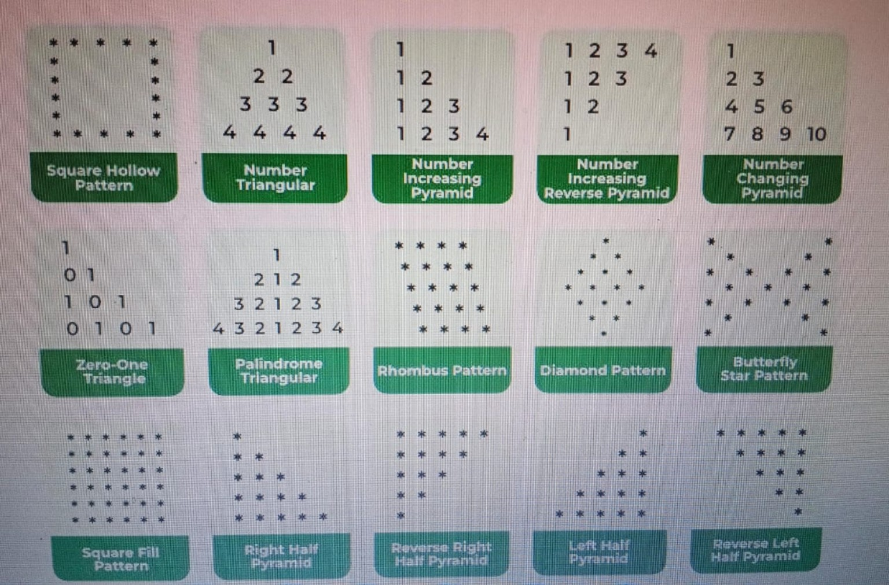

# Patterns Solution C++



```cpp
//1
#include<iostream>
using namespace std;

int main() {
int n = 5;
for(int i=1;i<=n;i++) {
for(int j=1;j<=n;j++) {
if(i==1||i==n||j==1||j==n)
cout<<"* ";
else
cout<<" ";
 }
cout<<endl;
 }
}
```

```cpp
//2
#include<iostream>
using namespace std;

int main() {
int n = 4;
for(int i=1;i<=n;i++) {
for(int j=1;j<=i;j++)
cout<<i<<" ";
cout<<endl;
 }
}
```

```cpp
//3
#include<iostream>
using namespace std;

int main() {
int n = 4;
for(int i=1;i<=n;i++) {
for(int j=1;j<=i;j++)
cout<<j<<" ";
cout<<endl;
 }
}
```

```cpp
//4
#include<iostream>
using namespace std;

int main() {
int n = 4;
for(int i=n;i>=1;i--) {
for(int j=1;j<=i;j++)
cout<<j<<" ";
cout<<endl;
 }
}
```

```cpp
//5
#include<iostream>
using namespace std;

int main() {
int n = 4, num = 1;
for(int i=1;i<=n;i++) {
for(int j=1;j<=i;j++)
cout<<num++<<" ";
cout<<endl;
 }
}
```

```cpp
//10
#include<iostream>
using namespace std;

int main() {
int n = 4;
for(int i=1;i<=n;i++) {
for(int j=1;j<=i;j++)
cout<<(i+j)%2<<" ";
cout<<endl;
 }
}
```

```cpp
//11
#include<iostream>
using namespace std;

int main() {
int n = 5;
for(int i=1;i<=n;i++) {
for(int j=1;j<=n;j++)
cout<<"* ";
cout<<endl;
 }
}
```

```cpp
//12
#include<iostream>
using namespace std;

int main() {
int n = 5;
for(int i=1;i<=n;i++) {
for(int j=1;j<=i;j++)
cout<<"* ";
cout<<endl;
 }
}
```

```cpp
//13
#include<iostream>
using namespace std;

int main() {
int n = 5;
for(int i=n;i>=1;i--) {
for(int j=1;j<=i;j++)
cout<<"* ";
cout<<endl;
 }
}
```

```cpp
//14
#include<iostream>
using namespace std;

int main() {
int n = 5;

for(int i=1;i<=n;i++) {
for(int s=1;s<=n-i;s++)
cout<<" ";
for(int j=1;j<=i;j++)
cout<<"* ";
cout<<endl;
 }
}
```

```cpp
//15 
#include<iostream>
using namespace std;

int main() {
int n = 5;

for(int i=n;i>=1;i--) {
for(int s=1;s<=n-i;s++)
cout<<" ";
for(int j=1;j<=i;j++)
cout<<"* ";
cout<<endl;
 }
}
```

